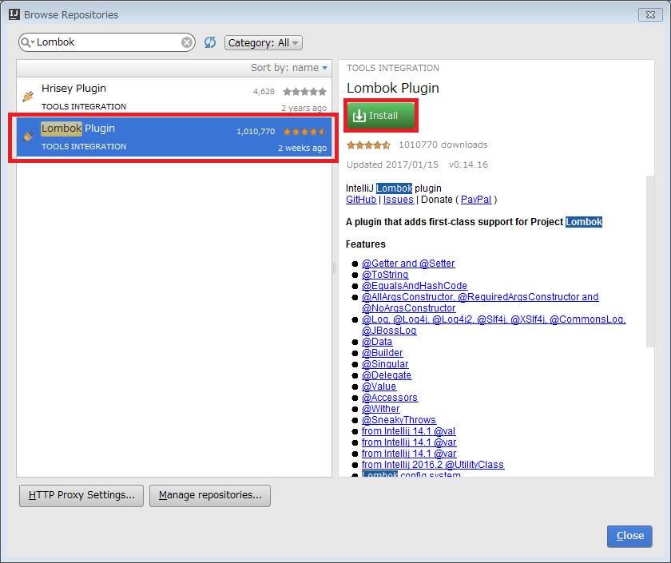
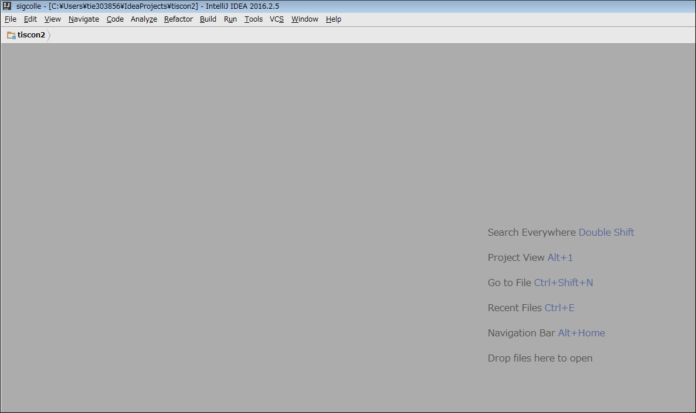
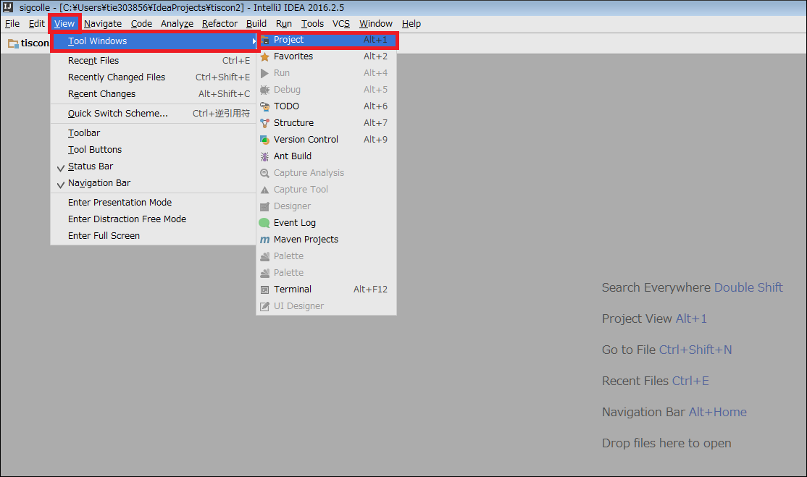
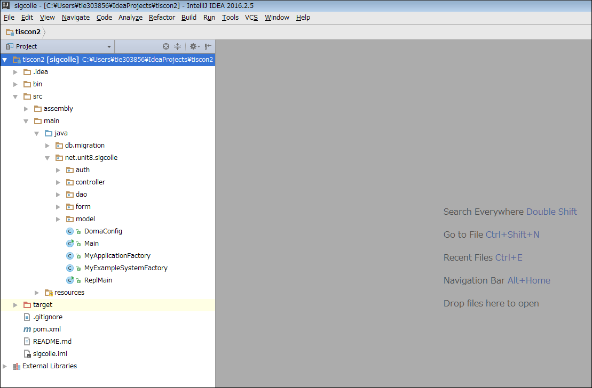
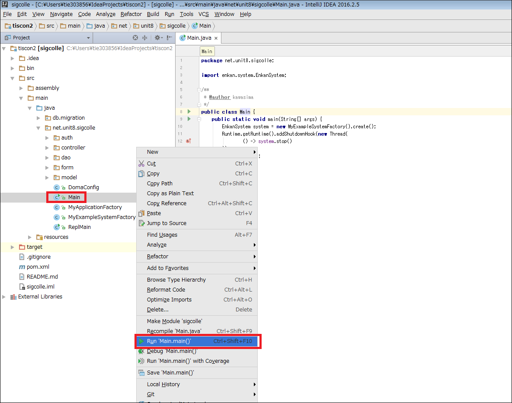

# tiscon2を自分のPCで動かすステップ

ここでは、[tiscon2](https://github.com/tiscon/tiscon2)を実際に動かしてプログラミングができるようになるためのいくつかのステップを紹介します。

> **前提条件**
> * インターネット接続した状態で行って下さい。
> * 作業想定時間は2~3時間です。
> * このステップが終わらないまま参加すると、当日の作業時間が減ってしまいます！わからないことがあった時に問い合わせる時間も考慮に入れて、余裕をもって準備を始めてください。

## 自分のPCでプログラミングする時の便利設定

* [Windowsマシンで開発を始める前に](preparationForWin.md)
* Macでは特にありません。

## ツールのインストール

### Java

Javaとは、プログラミング言語のJavaでプログラミングするのに必要なソフトウェアです。
これをインストールすると、自分のPCでJavaのプログラムを動かすことができるようになります。

* [Windowsマシン](installJavaWin.md)
* [Mac](installJavaMac.md)

### Maven

Javaで書いたプログラムを簡単に動せるようにするためのソフトウェア(ビルドツール)です。

* [Windowsマシン](installMavenWin.md)
* [Macマシン](installMavenMac.md)

### IntelliJ IDEA

Javaのプログラムを書くのに便利なエディタ(すごいメモ帳)です。
この手順はWindowsでもMacでもそう変わらないので同じ手順にします。

#### インストール

1. https://www.jetbrains.com/idea/#chooseYourEdition のDOWNLOADボタンから、**Community** のバージョンを選んでダウンロードしてください。
1. ダウンロードできたインストーラーを起動して、表示される手順に従ってインストールを進めてください。よくわからない項目はそのままYESを選択してください。

IntelliJを日本語化したい場合は、[IntelliJ IDEA 日本語化 | Qiita](http://qiita.com/makoto2468/items/6abf614b82cab865b745)が参考になります。

#### プラグインの設定

1. IntelliJを起動し、Configure > Settings を選択します。


1. Settingsウィンドウが表示されるので、左のバーからPluginsを選択し、Browse repositories...ボタンを押下します。


1. 検索バーに`Lombok`と入力し、Lombok Pluginを選択します。
   右側に表示されるInstallボタンを押下してください。
   ※検索結果が表示されない場合はプロキシ問題である可能性があります。
   **[参考 - プロキシの設定](ProxyGuide.md)**を参照してください。

1. 同様に、検索バーに`Jackson`と入力し、Jackson Generator Pluginを選択します。
   右側に表示されるInstallボタンを押下し、**IntelliJを再起動**してください。




## 外部サービスの準備

### Heroku

作ったアプリケーションを世界に公開するためのサイトです。こういうサービスはPaaSと呼ばれたりします。
[herokuを使ってWebアプリケーションを公開しよう | dcom](http://www.dcom-web.co.jp/technology/heroku1/)を参考に、herokuのアカウント作成、heroku toolbeltのインストールを行って下さい。

#### アカウント作成

下記サイトの「herokuのアカウント作成」を参考に、アカウント作成を行って下さい。
　※現在はHerokuのトップページへアクセスするとログインフォームへ自動的に移動します。
　　ログインフォーム下部の"Sign Up"から登録ページへアクセスしてください。

#### heroku toolbeltのインストール

引き続き下記サイトの「heroku toolbeltのインストール」を参考に、heroku toolbeltのインストール及び動作確認を行って下さい。  
　※「1.インストーラーのダウンロード」と「2.動作確認」まで行って下さい。
　　「3. heroku認証確認」以降は実施しないでください。
　　下記サイトでは、ダウンロードページのスクリーンショットが最新ではありません。
　　ダウンロードページの[Download and install]以下から自分のOSに合ったファイルをダウンロードしてください。
　※heroku toolbeltのインストーラを実行すると、Gitも合わせてインストールされます。
　　Gitインストール時、各種設定は全て初期状態のままで大丈夫です。

#### Gitの動作確認

前項のHerokuのインストールが正常に完了すると、同時にGitがインストールされます。
正常にGitがインストールされているかを確認するために、以下の手順を実施してください。
コマンドプロンプトを開き、
`git --version`
と入力します。gitのバージョン情報が表示されれば正常にインストールできています。

Windows-32bitの場合、heroku toolbeltのインストーラ実行時にgitのインストールが失敗する可能性があります。
上記コマンドを実行してもバージョン情報が表示されない場合、gitのインストールに失敗しています。
下記リンクからGitのインストーラをダウンロードして再度インストールしてください。
[【Git For Windows】](https://git-for-windows.github.io/)
※インストール時の設定は全て初期状態のままで大丈夫です。

### Github

Gitリポジトリのホスティングサービスです。
Gitに関して深く学びたい場合は、下記サイトを参照し理解に役立ててください。

- [【Git入門】](http://www.backlog.jp/git-guide/intro/intro1_1.html)
- [【ギットクエスト】](http://unit8.net/gq/)

### アカウント作成
下記サイトを参考に、**Githubのアカウント作成**を行って下さい。
※GithubはSEのSNSであり、GithubアカウントはSEにとって名刺のようなものです。
 一生モノのアカウント名に気を付けて作成してください。
[【GitHub アカウントの作成方法】](http://fnya.cocolog-nifty.com/blog/2014/01/github-185e.html)

## tiscon2のソースコードを手に入れる

### tiscon2のFork

[Github](https://github.com/)にログインし、下記ページの右上にあるForkボタンを押下してください。
[【tiscon2 - Githubページ】](https://github.com/tiscon/tiscon2)

## 動作確認

自分のPCでWebアプリケーションが正常に動作するかを確認します。

### IntelliJでプロジェクトをcloneする

1. ユーザフォルダ配下にIdeaProjectsフォルダを作成します。(例) `C:\Users\ユーザ名\IdeaProjects`
1. IntelliJを起動し、Check out from Version Control > Git を選択します。
1. Git Repository URLに `https://github.com/[Githubのユーザ名]/tiscon2.git` を入力します。
1. Cloneボタンを押下します。
   ※「The parent path～」と表示されている場合、Parent Directory項目右の…ボタンを押下し、作成したIdeaProjectsフォルダを選択してください。
1. 画面下部にステータスが表示されます。バーの表示が消えればcloneは完了です。
※下図のような画面が表示された場合、『No』を選択し、下記の手順に従ってcloneしたプロジェクトを開いてください。


### プロジェクトを開く

プロジェクトのclone時に自動的にプロジェクトが開いた場合、以下の手順は飛ばしてください。

1. IntellijのWelcome画面からOpen を選択します。


1. "C:\Users\ユーザ名\IdeaProjects\tiscon2"を選択し、OKを押します。


1. tiscon2プロジェクトが開けました。続いてソースコードを確認できるようにします。


### ソースコード確認

1. IntelliJ上部メニューバーから、`View > Tool Windows > Project` を選択します。


1. Project Viewよりプロジェクト内のソースコードが確認できるようになりました。


### ローカルでの動作確認
cloneしたwebアプリケーションが正常に動くか、ローカル上で動作確認を行います。

1. Project Viewから `Main.java` を選択し、右クリックメニューから `Run 'Main main()'` を実行します。


1. 画面下部にログが表示されます。起動が完了すると下図のようにログが表示されます。
   起動後はブラウザから http://localhost:3000 にアクセスすることでトップページが開きます。


### オンライン上での動作確認

Heroku上にデプロイし、オンラインで動作することを確認しましょう。
Herokuにログインした状態で、[tiscon2](https://github.com/tiscon/tiscon2)のREADME.md > にある、デプロイボタンを押下してください。

> **注意点**
> * HerokuへのログインはHerokuのホームページから行って下さい。

## 作業に行き詰った場合

環境構築中に分からないことがあったら、まずは[QA一覧](QA.md)を参考にしてみてください。

上記ページを見ても解決せず、自身で調べても上手くいかない場合は、下記のテンプレートを用いてメールにて質問してください。
何が上手くいっていないかわからない、などの場合も一度スクリーンショットと環境構築手順書のどの手順で分からなくなったのかを教えてください。
内容に応じてメールもしくは電話でサポートします。

### テンプレート

```
メールアドレス：
　tiscon@ml.tis.co.jp
件名：
　【インターン環境構築】[作業名]が上手くいきません。
本文：
TIS インターン ITアーキテクトコース 実施担当者様

[所属大学]の[氏名]です。

[参加予定日]のインターン実施に向け、環境構築を行っていましたが、[作業名]が上手くいきません。

【作業状況】
（※環境構築手順のどこまで進めたか記載）

【問題】
（※何が上手くいっていないのか、どのようなエラーが出ているのか記載）

【連絡先】
（※日中連絡がとれる電話番号）

以上です、ご返答の程お願いいたします。
```

### 例文

```
メールアドレス：
　tiscon@ml.tis.co.jp
件名：
　intelliJの日本語化が上手くいきません。
本文：
TIS インターン ITアーキテクトコース 実施担当者様

ADC大学の奈部 楽太郎です。

2/18(土)、19(日)のインターン参加に向けて、環境構築を行っていますが
環境構築手順書の[IntelliJ IDEA 日本語化]のサイトに記載してある
通りに作業をしたのですが、日本語化が上手くできません。

【作業状況】
参照先の手順はすべてやったのですが、自分のPCに以下のフォルダが見つからず、
自分で新規フォルダを作成したのですが、うまく動きません。

サイトに書いてあるフォルダ名(この通りに新規のフォルダを作成しました)
C:\Program Files (x86)\JetBrains\IntelliJ IDEA Community Edition 14.1.4\lib

私のPCにできていたフォルダ名
C:\Program Files\JetBrains\IntelliJ IDEA Community Edition 14.1.4\lib

【問題】
なぜか日本語化されていない。
何も変わっていないように見える。

【連絡先】
0X0-XXXX-XXXX
15時以降であれば何時でも大丈夫です。

以上です、ご返答の程お願いいたします。
```
