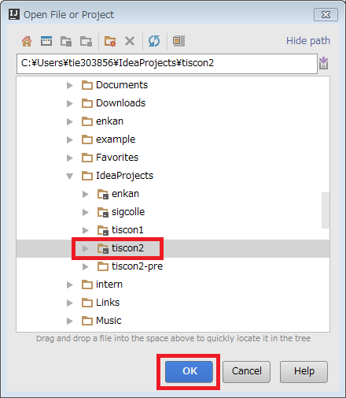
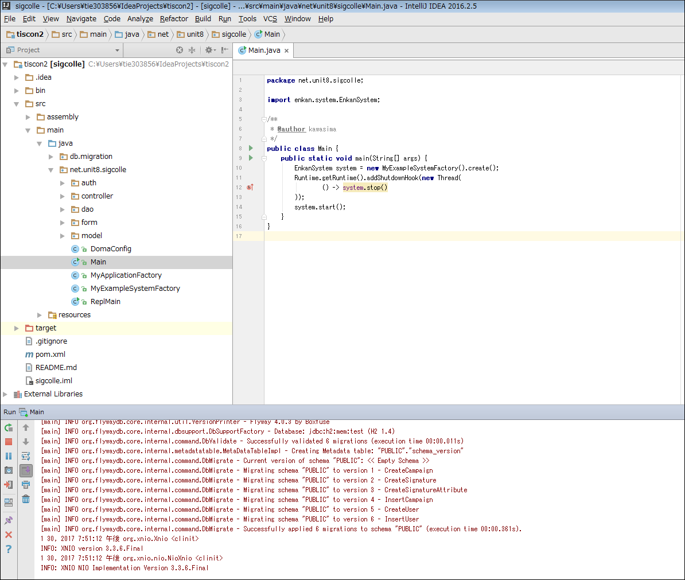
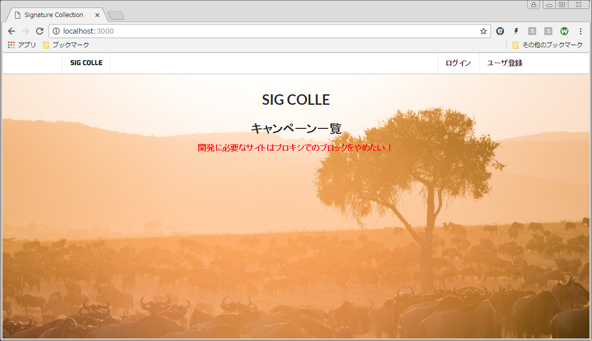

# 環境構築手順
本ドキュメントではtiscon2プロジェクト動作に必要となる環境構築の手順を示します。
環境構築を行うに当たり、インターネット接続した状態で行って下さい。

また、本ドキュメントは環境構築対象PCのOSがWindowsを想定しています。
他のOSの場合は、各自適した設定を行うようにしてください。

作業想定時間は2~3時間です。
環境構築が完了しないまま参加した場合、インターン当日環境構築に大きく時間を割かれることとなります。
不測の事態や不明点があった際に問い合わせる時間も考慮し、余裕をもって準備しておくよう心掛けてください。


## 事前準備

### 自身の環境確認
下記サイトを参考に、PCで32bit版、64bit版のいずれを実行しているのかを調べます。
[【Windowsの32bit版または64bit版のいずれを実行しているのか調べる】](http://windows.microsoft.com/ja-jp/windows7/find-out-32-or-64-bit)

どちらで実行しているかにより、以降の作業でのダウンロードファイルなどが異なる場合があります。
特に指定が無い場合、インストール先はデフォルトの設定で問題ありません。

### ファイルの拡張子表示
下記サイトを参考に、拡張子を表示するよう設定してください。
[【Windowsで拡張子を表示させる】](https://www.microsoft.com/ja-jp/atlife/tips/archive/windows/tips/252.aspx)

### コマンドプロンプトの起動方法
環境構築手順において、度々コマンドプロンプトからコマンドを実行する必要あります。
コマンドプロンプトはWindowsの場合、以下の手順で起動できます。
`スタート > すべてのプログラム > アクセサリ > コマンドプロンプトを選択 `
環境変数の編集時などは、コマンドプロンプトを再起動しないと設定が反映されません。
コマンドの実行結果が想定通りでない場合、一度コマンドプロンプトを再起動してみてください。

### ★環境変数「Path」編集時の注意点
以降の環境構築手順内で、環境変数「Path」を編集する必要があります。
**環境変数の「Path」を編集する場合、もともと記載されている設定は消さないでください。**
消すとPCが動かなくなる場合がありますので、必要な設定の**追記**のみ行ってください。
問題が発生した時に作業前の状態に戻せるよう、環境変数を編集する際は、**編集前の値をテキストファイル等にバックアップ**しておいてください。
設定を追記する際は、既存の値と新しく設定する値の間を";"で区切ってください。

### プロキシ設定

プロキシ環境下で作業を行う場合、いくつかの手順でプロキシの設定が必要になります。
プロキシの設定方法は下記を参照してください。
[参考 - プロキシの設定](ProxyGuide.md)

## JDK8
Java(プログラミング言語)で開発を行うのに必要なソフトウェアをまとめたパッケージです。
下記サイトを参考に、**JDK8のインストール**及び**環境変数の設定**を行って下さい。

※下記サイトに記載されたjdkのバージョンは最新ではありません(jdk-8u5)。
  最新のバージョンをダウンロードしてください。1月末日時点での最新バージョンはjdk-8u121です。
**※環境変数のパス設定には、自身がインストールした先のパスを設定するよう注意してください。**

[【JDK8(Java8)のインストール方法】](http://javaworld.helpfulness.jp/post-24/)

※環境変数の設定変更確認
Pathの確認
```java -version```
JAVA_HOMEの確認
Windowsなら
```echo %JAVA_HOME%```
Macなら
```echo $JAVA_HOME```
想定される実行結果は上記サイトの「環境変数の設定変更確認」を参照してください。


## Maven3
Apache Software Foundationで開発されているソフトウェアプロジェクト管理ツールです。
下記サイトを参考に、**Maven3のインストール**及び**環境変数の設定**を行って下さい。
下記サイトには「環境変数の設定は3つ」と記載がありますが、この項目での**JAVA_HOME、M2_HOMEの設定は不要**です。
今回は環境変数「PATH」1つのみの設定を行って下さい。

※**『手順2. 配置』では解凍して出来た『apache-maven-3.2.5』フォルダを、そのまま以下のフォルダに配置してください。**
　`C:\Program Files`  

※環境変数のパス設定には、展開先のパスを反映するよう注意してください。
　"C:\Program Files"配下にフォルダを配置した場合、環境変数に設定するパスは
　`"C:\Program Files\apache-maven-3.2.5\bin"`
　となります。

[【Apache Maven3 (3.2.5) インストール手順】](http://weblabo.oscasierra.net/install-maven-32-windows/)


## IntelliJ IDEA
JetBrains社が開発した統合開発環境です。
下記サイトを参考に、**IntelliJ IDEAのCommunity Editionをインストール**してください。
また、併せてProject Settingsより**JDKの設定**を行って下さい。

※下記サイトに記載されている**IntelliJ IDEAに関する項目のみ参照**してください。JDKとGitの設定は別途行うので、不要です。

※下記サイトに記載されたIntelliJのバージョンは最新ではありません(14.0.2)。
  最新のバージョンをダウンロードしてください。1月末日時点での最新バージョンは2016.3.3です。

※下記サイトではIntellijのインストールフォルダを変更するよう記載されていますが、**インストールフォルダは初期設定から変更しないでください。**


※下記サイトは64bit版について記載されています。
32bitの場合は初回起動時、「idea64.exe」ではなく同フォルダに存在する「idea.exe」を実行してください。

[【IntelliJ IDEA 14.0.2 インストール手順】](http://ksby.hatenablog.com/entry/2014/12/27/233427)

IntelliJを日本語化したい場合は下記を参考にしてください。
※resources_jp.jarを`自身がIntellijをインストールしたフォルダ>lib`に配置してください。
[【IntelliJ IDEA 日本語化】](http://qiita.com/makoto2468/items/6abf614b82cab865b745)


### プラグインの設定
1. IntelliJを起動し、Configure > Settings を選択します。


1. Settingsウィンドウが表示されるので、左のバーからPluginsを選択し、Browse repositories...ボタンを押下します。


1. 検索バーに`Lombok`と入力し、Lombok Pluginを選択します。
   右側に表示されるInstallボタンを押下してください。
   ※検索結果が表示されない場合はプロキシ問題である可能性があります。
   **[参考 - プロキシの設定](ProxyGuide.md)**を参照してください。

1. 同様に、検索バーに`Jackson`と入力し、Jackson Generator Pluginを選択します。
   右側に表示されるInstallボタンを押下し、**IntelliJを再起動**してください。


## Heroku
PaaSの1つであり、Webアプリケーションのオンライン上での公開を行えるプラットフォームです。
下記サイトを参考に、herokuのアカウント作成、heroku toolbeltのインストールを行って下さい。

#### アカウント作成
下記サイトの「herokuのアカウント作成」を参考に、アカウント作成を行って下さい。
　※現在はHerokuのトップページへアクセスするとログインフォームへ自動的に移動します。
　　ログインフォーム下部の"Sign Up"から登録ページへアクセスしてください。

#### heroku toolbeltのインストール
引き続き下記サイトの「heroku toolbeltのインストール」を参考に、heroku toolbeltのインストール及び動作確認を行って下さい。  
　※「1.インストーラーのダウンロード」と「2.動作確認」まで行って下さい。
　　「3. heroku認証確認」以降は実施しないでください。
　　下記サイトでは、ダウンロードページのスクリーンショットが最新ではありません。
　　ダウンロードページの[Download and install]以下から自分のOSに合ったファイルをダウンロードしてください。
　※heroku toolbeltのインストーラを実行すると、Gitも合わせてインストールされます。
　　Gitインストール時、各種設定は全て初期状態のままで大丈夫です。

  [【Herokuの準備】](http://www.dcom-web.co.jp/technology/heroku1/)

### Gitの動作確認
前項のHerokuのインストールが正常に完了すると、同時にGitがインストールされます。
正常にGitがインストールされているかを確認するために、以下の手順を実施してください。
コマンドプロンプトを開き、
`git --version`
と入力します。gitのバージョン情報が表示されれば正常にインストールできています。

Windows-32bitの場合、heroku toolbeltのインストーラ実行時にgitのインストールが失敗する可能性があります。
上記コマンドを実行してもバージョン情報が表示されない場合、gitのインストールに失敗しています。
下記リンクからGitのインストーラをダウンロードして再度インストールしてください。
[【Git For Windows】](https://git-for-windows.github.io/)
※インストール時の設定は全て初期状態のままで大丈夫です。


## Github
Gitリポジトリのホスティングサービスです。
Gitに関して深く学びたい場合は、下記サイトを参照し理解に役立ててください。
- [【Git入門】](http://www.backlog.jp/git-guide/intro/intro1_1.html)
- [【ギットクエスト】](http://unit8.net/gq/)

### アカウント作成
下記サイトを参考に、**Githubのアカウント作成**を行って下さい。
※GithubはSEのSNSであり、GithubアカウントはSEにとって名刺のようなものです。
 一生モノのアカウント名に気を付けて作成してください。
[【GitHub アカウントの作成方法】](http://fnya.cocolog-nifty.com/blog/2014/01/github-185e.html)


### tiscon2のFork
[Github](https://github.com/)にログインし、下記ページの右上にあるForkボタンを押下してください。
[【tiscon2 - Githubページ】](https://github.com/tiscon/tiscon2)


## 動作確認
環境構築したPCでWebアプリケーションが正常に動作するかを確認します。
当日はローカルで動作を確認しながらコードの修正を行っていきます。

### IntelliJでのプロジェクトのclone手順
1. ユーザフォルダ配下にIdeaProjectsフォルダを作成します。(例)C:\Users\ユーザ名\IdeaProjects
1. IntelliJを起動し、Check out from Version Control > Git を選択します。
1. Git Repository URLに以下を入力します。
   `https://github.com/[Githubのユーザ名]/tiscon2.git`
1. Cloneボタンを押下します。
   ※「The parent path～」と表示されている場合、Parent Directory項目右の…ボタンを押下し、作成したIdeaProjectsフォルダを選択してください。
1. 画面下部にステータスが表示されます。バーの表示が消えればcloneは完了です。
※下図のような画面が表示された場合、『No』を選択し、下記の手順に従ってcloneしたプロジェクトを開いてください。


##### プロジェクトを開く
プロジェクトのclone時に自動的にプロジェクトが開いた場合、以下の手順は飛ばしてください。

1. IntellijのWelcome画面からOpen を選択します。


1. "C:\Users\ユーザ名\IdeaProjects\tiscon2"を選択し、OKを押します。


1. tiscon2プロジェクトが開けました。続いてソースコードを確認できるようにします。


### ソースコード確認
1. IntelliJ上部メニューバーから、View > Tool Windows > Projectを選択します。


1. Project Viewよりプロジェクト内のソースコードが確認できるようになりました。


### ローカルでの動作確認
cloneしたwebアプリケーションが正常に動くか、ローカル上で動作確認を行います。

1. Project ViewからMain.javaを選択し、右クリックメニューから『Run ’Main main()’』を実行します。


1. 画面下部にログが表示されます。起動が完了すると下図のようにログが表示されます。
   起動後はブラウザから http://localhost:3000 にアクセスすることでトップページが開きます。



### オンライン上での動作確認
Heroku上にデプロイし、オンラインで動作することを確認しましょう。
Herokuにログインした状態で、[tiscon2](https://github.com/tiscon/tiscon2)のREADME.md>[環境構築]にある、デプロイボタンを押下してください。
※HerokuへのログインはHerokuのホームページから行って下さい。


<br/>
### 作業に行き詰った場合
環境構築中に分からないことがあったら、まずは[QA一覧](QA.md)を参考にしてみてください。

上記ページを見ても解決せず、自身で調べても上手くいかない場合は、下記のテンプレートを用いてメールにて質問してください。
何が上手くいっていないかわからない、などの場合も一度スクリーンショットと環境構築手順書のどの手順で分からなくなったのかをお送りいただければと思います。
内容に応じてメールもしくは電話でサポートします。


---------- テンプレート ここから ----------
メールアドレス：
　tiscon@ml.tis.co.jp
件名：
　【インターン環境構築】[作業名]が上手くいきません。
本文：
TIS インターン ITアーキテクトコース 実施担当者様

[所属大学]の[氏名]です。

[参加予定日]のインターン実施に向け、環境構築を行っていましたが、[作業名]が上手くいきません。

【作業状況】
（※環境構築手順のどこまで進めたか記載）

【問題】
（※何が上手くいっていないのか、どのようなエラーが出ているのか記載）

【連絡先】
（※日中連絡がとれる電話番号）

以上です、ご返答の程お願いいたします。

---------- テンプレート ここまで ----------

<br/>

---------- 例文 ここから ----------
メールアドレス：
　tiscon@ml.tis.co.jp
件名：
　intelliJの日本語化が上手くいきません。
本文：
TIS インターン ITアーキテクトコース 実施担当者様

ADC大学の奈部 楽太郎です。

2/18(土)、19(日)のインターン参加に向けて、環境構築を行っていますが
環境構築手順書の[IntelliJ IDEA 日本語化]のサイトに記載してある
通りに作業をしたのですが、日本語化が上手くできません。

【作業状況】
参照先の手順はすべてやったのですが、自分のPCに以下のフォルダが見つからず、
自分で新規フォルダを作成したのですが、うまく動きません。

サイトに書いてあるフォルダ名(この通りに新規のフォルダを作成しました)
C:\Program Files (x86)\JetBrains\IntelliJ IDEA Community Edition 14.1.4\lib

私のPCにできていたフォルダ名
C:\Program Files\JetBrains\IntelliJ IDEA Community Edition 14.1.4\lib

【問題】
なぜか日本語化されていない。
何も変わっていないように見える。

【連絡先】
0X0-XXXX-XXXX
15時以降であれば何時でも大丈夫です。

以上です、ご返答の程お願いいたします。

---------- 例文 ここまで ----------
